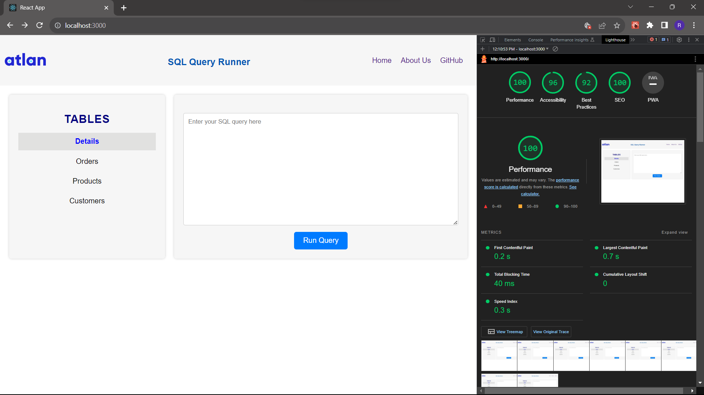

# SQL Query Runner - Atlan Assignment

Assignment: Develop a web-based application for executing SQL queries and displaying the results. The application should allow users to input SQL queries, execute them, and visualize the query results within the application.

Deployed To: **https://ronak-sql-query-runner.netlify.app/**

App fulfills all the requirements that were mentioned by team Atlan. You can run different queries on the table and view the data of each table.

## Functionality Overview:

- Users can input SQL queries.
- Predefined tables are available for users to select from.
- The SQL query results are displayed in a tabular format.
- Users can customize the number of rows displayed per page for convenient viewing.
- Application is able to load large amounts of rows without breaking the browser..see the details table in the application.

## Key libraries Used

- React
- papaparse

## Data Source

The application utilizes CSV files provided by Atlan. Papaparse is employed to load the data from these files when a query requires data retrieval.

## Steps taken to Optimize

- Lazy loading with React.lazy() and Suspense for code-splitting and improved loading performance.
- Memoization with React.memo to prevent unnecessary re-renders.
- Importing specific modules instead of the entire library to reduce bundle size.
- Extracting reusable logic into custom hooks for code organization and reusability.
- Effective error handling for a robust application.
- Using shorthand for boolean props and self-closing tags for improved code readability.

By implementing these techniques, the application achieves faster loading times, optimized rendering, and improved code maintainability

# Page Load Time and Performance

